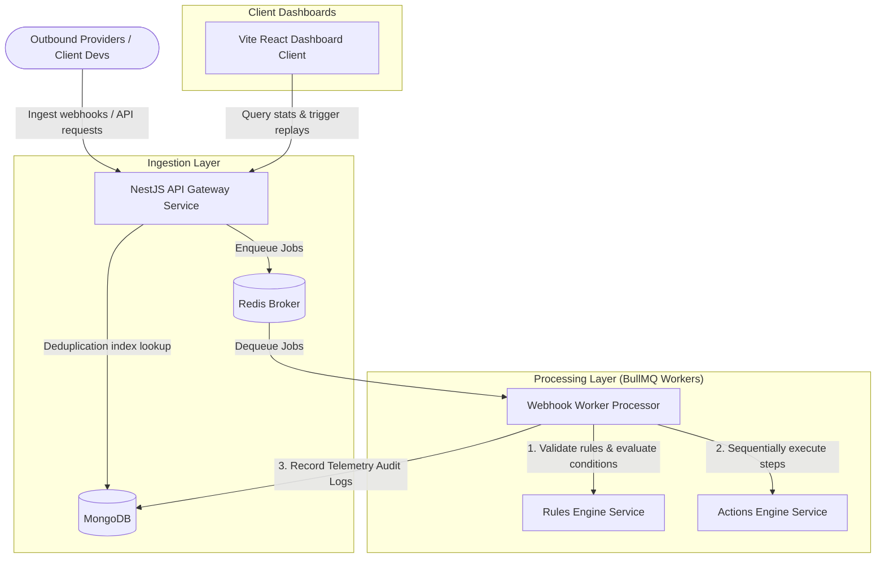

# Multi-Tenant Async Webhook Automation Engine

A high-performance, production-ready, multi-tenant Async Webhook Automation Engine built with **NestJS**, **TypeScript**, **MongoDB**, and **BullMQ/Redis**.

---

## 1. System Architecture

The engine uses a decoupled architecture where the API gateway ingestion layer and the worker processing layers communicate asynchronously via Redis queues.



---

## 2. Project Structure

The codebase is organized as a monorepo separated into isolated packages:

```
├── backend                  # NestJS backend application root
│   ├── src
│   │   ├── actions          # Step execution integrations (HTTP, mock email, slack)
│   │   ├── common           # Loggers, filters, interceptors, middleware
│   │   ├── config           # Environment configuration and schemas
│   │   ├── dashboard        # Dashboard metrics endpoints
│   │   ├── database         # Mongoose connection bootstrapper
│   │   ├── executions       # Rules execution telemetry models and controller
│   │   ├── queue            # BullMQ connection setups
│   │   ├── rules            # Rules engine matching logic, schemas, controller
│   │   ├── tenant           # Tenant configuration, settings, guards
│   │   ├── webhooks         # Webhook ingestion, signature verification, workers
│   │   └── seed.ts          # Idempotent database seeder
│   └── package.json
├── frontend                 # React + Vite + TypeScript dashboard app
│   ├── src
│   │   ├── api              # Axios client and interceptors
│   │   ├── components       # Reusable enterprise UI library components
│   │   ├── views            # Dashboard, Webhooks, Rules, Executions, Replays views
│   │   └── App.tsx          # Router and layouts shell
│   └── package.json
├── testing                  # Integration testing scripts and configs
│   ├── simulate.js          # Automated simulation testing scenario
│   ├── curl_commands.md     # Ingestion test curl reference commands
│   └── postman_collection.json # Postman requests mapping
├── docker-compose.yml       # Orchestrates multi-container development environment
└── README.md                # System documentation
```

- **backend/**: Contains the core API logic, validation layers, database models, worker processors, and queue consumers.
- **frontend/**: Provides a premium enterprise SaaS dashboard client built on modern React.
- **testing/**: Houses mock integration scenarios, verification programs, and payload configurations.

---

## 3. Data Model & Schemas

### Tenants (`tenants` collection)
Enforces logical isolation boundaries across all queries.
```typescript
{
  _id: ObjectId,
  name: String,
  apiKey: String,
  domain: String,
  status: 'active' | 'suspended' | 'deleted',
  settings: {
    maxDailyExecutions: Number,
    maxRules: Number,
    alertEmail: String,
    webhookSecrets: Map<String, String> // Map of webhook source to signature validation secrets
  }
}
```

### Webhook Events (`webhookevents` collection)
Stores incoming payloads. Enforces uniqueness using a compound index on `{ tenantId: 1, eventIdentifier: 1 }`.
```typescript
{
  _id: ObjectId,
  tenantId: ObjectId,
  eventIdentifier: String, // Deterministic unique identifier
  source: String,          // e.g. 'stripe'
  eventType: String,       // e.g. 'payment_failed'
  payload: Object,         // Raw payload
  headers: Object,         // Ingestion HTTP headers
  status: 'pending' | 'processing' | 'completed' | 'failed',
  retryCount: Number,
  maxRetries: Number,
  error: String
}
```

### Automation Rules (`automationrules` collection)
Rules containing match criteria, validation schema, and sequential steps.
```typescript
{
  _id: ObjectId,
  tenantId: ObjectId,
  name: String,
  description: String,
  triggerSource: String,
  triggerEventType: String,
  status: 'active' | 'inactive',
  conditions: [
    { field: String, operator: 'equals'|'notequals'|'contains'|'greaterThan'|'lessThan', value: Any }
  ],
  actions: [
    { order: Number, actionType: 'http_call'|'slack_notify'|'email_send'|'db_operation', config: Object }
  ],
  payloadSchema: Object     // Optional key-value object schema for incoming webhook validation
}
```

### Executions (`executions` collection)
Tracks execution logs, retry counts, duration, and step-level state telemetry.
```typescript
{
  _id: ObjectId,
  tenantId: ObjectId,
  ruleId: ObjectId,
  webhookEventId: ObjectId,
  status: 'queued' | 'processing' | 'completed' | 'failed' | 'retrying',
  retryCount: Number,
  startedAt: Date,
  completedAt: Date,
  durationMs: Number,
  error: String,
  steps: [
    {
      actionIndex: Number,
      actionType: String,
      status: 'success' | 'failed',
      error: String,
      requestPayload: Object,
      responsePayload: Object,
      durationMs: Number,
      executedAt: Date
    }
  ]
}
```

### Replay History (`replayhistories` collection)
Audits manual replays.
```typescript
{
  _id: ObjectId,
  tenantId: ObjectId,
  webhookEventId: ObjectId,
  triggeredBy: String,
  reason: String,
  status: String,
  executionId: ObjectId
}
```

---

## 4. Main API Endpoints

All endpoints require a valid tenant context headers. Admin and dashboard endpoints enforce API Key validation.

| Method | Endpoint | Purpose | Authentication / Tenant Headers |
|---|---|---|---|
| `POST` | `/api/webhooks/:source` | Ingests an incoming raw webhook from a provider (Stripe, Shopify, etc.) | `X-Tenant-ID` (Required) & platform signature headers |
| `POST` | `/api/webhooks/replay` | Manually triggers a retry/replay of a specific webhook event | `X-Tenant-ID`, `X-API-Key` |
| `GET` | `/api/webhooks/replays` | Lists replay log audit entries for a tenant | `X-Tenant-ID`, `X-API-Key` |
| `GET` | `/api/webhooks` | Lists or filters ingested webhook logs | `X-Tenant-ID`, `X-API-Key` |
| `GET` | `/api/webhooks/:id` | Fetches a single webhook event record by ID | `X-Tenant-ID`, `X-API-Key` |
| `GET` | `/api/rules` | Lists all automation rules configured for a tenant | `X-Tenant-ID`, `X-API-Key` |
| `POST` | `/api/rules` | Creates a new automation rule | `X-Tenant-ID`, `X-API-Key` |
| `DELETE` | `/api/rules/:id` | Removes an automation rule | `X-Tenant-ID`, `X-API-Key` |
| `GET` | `/api/executions` | Queries execution logs (supports status, page, limit filters) | `X-Tenant-ID`, `X-API-Key` |
| `POST` | `/api/executions/:id/replay` | Replays a failed execution from the point of failure | `X-Tenant-ID`, `X-API-Key` |
| `GET` | `/api/dashboard/stats` | Fetches real-time counts, metrics, and KPI statistics for dashboard | `X-Tenant-ID`, `X-API-Key` |

---

## 5. Queue Design

* **Broker:** Redis database served via `BullMQ`.
* **Queue Name:** `webhook-queue`
* **Concurrency:** Configured to `10` parallel workers per instance (scalable).
* **Job Lock Settings:**
  * `lockDuration: 30000ms` (30 seconds visibility timeout to prevent duplicate worker pickup).
  * `lockRenewTime: 15000ms` (renews lock every 15 seconds for long-running processes).
  * `stalledInterval: 30000ms` (checks for crashed/dead lock holders every 30s).
  * `maxStalledCount: 2` (stalled jobs are retried up to 2 times before marking as failed).
* **Job Payload Structure:**
  A job payload is minimal and lightweight to optimize Redis memory footprint, passing references instead of raw data:
  ```json
  {
    "webhookEventId": "60d5ec4a2f8fb814c8f8d9f1",
    "tenantId": "60d5ec4a2f8fb814c8f8d9f1"
  }
  ```

---

## 6. Webhook Processing Flow

1. **Ingest Gateway:** Enforces tenant existence and validation checks.
2. **Signature Verification:** Computes dynamic HMAC signature check using timing-safe cryptographic comparisons (e.g. Stripe, Shopify, GitHub) if a tenant has a secret key configured.
3. **Deduplication:** Computes a deterministic payload hash. Attempts to insert to MongoDB. If MongoDB returns error code `11000` (duplicate key), ingestion returns HTTP 200 immediately, bypassing the BullMQ queue.
4. **Queue Enqueue:** A BullMQ background job is spawned.
5. **Worker Dequeue:**
   * Checks if an execution is already in progress.
   * **Rule Matching:** Evaluates the webhook event against active tenant rules.
   * **Conditions Check:** Evaluates logic operator parameters (`equals`, `contains`, `greaterThan`, `lessThan`).
   * **Steps Execution Loop:** Executes actions sequentially.
     * Checks if a step was already successfully executed in a previous attempt (for replays) to maintain **idempotency**.
     * Logs response telemetry.

---

## 7. Simulating an Incoming Webhook

Incoming webhooks are ingested via the `/api/webhooks/:source` endpoint.

### Sample Ingestion Request (Stripe Payment Failed)
```bash
curl.exe -X POST http://localhost:3000/api/webhooks/stripe \
  -H "X-Tenant-ID: 60d5ec4a2f8fb814c8f8d9f1" \
  -H "Content-Type: application/json" \
  -H "stripe-signature: t=1672531199,v1=sha256_mock_sig" \
  -d '{
    "id": "evt_stripe_payment_fail_100",
    "type": "payment_failed",
    "amount": 99.99,
    "failure_code": "card_declined",
    "failure_message": "Card has expired",
    "customer_email": "jane@example.com"
  }'
```

### Expected HTTP Ingest Response
```json
{
  "success": true,
  "eventId": "evt_stripe_payment_fail_100"
}
```

### Expected Processing Lifecycle
1. **HTTP Ingress:** API Gateway validates `X-Tenant-ID` header.
2. **Signature Check:** Verifies signature match (skipped for mock sigs unless tenant secrets are enabled).
3. **Ingestion & Deduplication:** Webhook payload is saved to MongoDB. If the event ID matches an existing record, the write fails silently, returning HTTP 200.
4. **Enqueueing:** Webhook task enqueued to `webhook-queue`.
5. **Worker Execution:** Background consumer pulls task, evaluates rules, runs matching actions step-by-step, and outputs step telemetry to MongoDB.

---

## 8. Failure Handling, Crash Recovery & Replay

### Exception Types
1. **`RetryableActionException`:** Thrown on transient failures (e.g. HTTP 503, connection timeouts). BullMQ intercepts this and triggers an exponential backoff retry.
2. **`NonRetryableActionException`:** Thrown on configuration or client errors (e.g. HTTP 400 Bad Request, missing configurations). The job calls `await job.discard()`, halts further retries, and transitions the execution state to `'failed'` immediately.

### Worker Crash Recovery
If a worker crashes/reboots mid-execution:
1. BullMQ's stalled job manager detects the lost lock after `lockDuration` (30s) expires.
2. The queue listener (`@OnQueueEvent('failed')`) catches the failed job.
3. The listener updates the database state: the execution and webhook event statuses are transitioned from `'processing'` to `'failed'`, ensuring no jobs are silently lost or left permanently in `'processing'`.

### Failed Execution Replay Flow
We expose a REST endpoint `POST /api/executions/:id/replay`.
* **Constraint:** Replay is only permitted for executions with a `'failed'` status.
* **Original Payload Reuse:** Fetches the original webhook event data and triggers a new BullMQ job.
* **Step-Level Resume:** During the execution loop, the worker checks the previous execution steps trace. Steps that already finished with status `'success'` are skipped (safeguarding against double billing or duplicate external side effects), and only failed or unexecuted steps are run.

---

## 9. Triggering Failure and Replay (Reviewer Test Guide)

Reviewers can intentionally trigger a failure and verify the replay flow:

1. **Create a failing rule:** Navigate to the **Rules** tab, create a rule matching source `stripe` and event `payment_failed`. Add an action step with type `http_call` pointing to an invalid url (e.g., `https://invalid-destination.xyz/fail`).
2. **Ingest Webhook:** Execute the Stripe webhook simulation curl command (detailed in Section 7).
3. **Observe Failure:**
   - Go to the **Webhooks** view to verify the event is saved as `failed`.
   - Go to the **Execution History** view. Expand the failing execution to view the specific step exception trace.
4. **Trigger Replay:**
   - Click the **Replay** button on the failed execution row in the UI (or execute `POST /api/executions/:id/replay`).
   - The execution status will change to `queued`, transition to `processing`, and restart the failed step.

---

## 10. How to Run

### Option A: Complete Docker Compose (Recommended)
Boot up the backend, frontend, MongoDB, and Redis with one command:
```bash
docker-compose up --build
```
* **Frontend Dashboard:** `http://localhost:8080`
* **Backend API Gateway:** `http://localhost:3000/api`

### Option B: Local Development
Ensure local MongoDB and Redis instances are running, then run:

**1. Backend:**
```bash
cd backend
npm install
cp .env.example .env
npm run start:dev
```

**2. Frontend:**
```bash
cd frontend
npm install
npm run dev
```

---

## 11. Database Configuration

The application supports multiple MongoDB configurations depending on your evaluation or development workflow.

### Option 1 – Docker (Recommended)

This is the default setup for reviewers. Running:

```bash
docker-compose up --build
```

automatically starts all required services including:
* MongoDB
* Redis
* Backend API Gateway
* Frontend Dashboard

No local MongoDB installation is required. Docker configures the MongoDB container automatically and the backend connects to it using the configured environment variable.

The Docker connection string inside the environment is:
```env
MONGO_URI=mongodb://mongodb:27017/webhook-engine
```
*Note: The hostname is `mongodb` instead of `localhost` because Docker containers communicate across the bridge network using their service names.*

---

### Option 2 – Local MongoDB

Developers can use their own locally installed MongoDB instance instead of the Docker container. 

The local connection string configuration inside the environment is:
```env
MONGO_URI=mongodb://localhost:27017/webhook-engine
```
This configuration should be used when the backend is running directly on the host machine rather than inside the Docker virtual network.

---

### Option 3 – MongoDB Atlas or Remote MongoDB

The application can connect to any remote MongoDB instance (such as MongoDB Atlas) by simply updating the environment variable. 

For example, update the connection URI in `.env`:
```env
MONGO_URI=mongodb+srv://<username>:<password>@cluster0.mongodb.net/webhook-engine?retryWrites=true&w=majority
```
No application source code changes are required. Simply update the environment variable, and the NestJS database bootstrapper will mount the remote cluster.

---

### Switching Between Configurations

The application never hardcodes the database connection string. It always reads the target cluster from the `MONGO_URI` environment variable. Changing this value is sufficient to switch between:
* Docker MongoDB
* Local MongoDB
* MongoDB Atlas
* Any remote MongoDB deployment

---

### Developer Notes

* If the backend runs inside Docker, `localhost` refers to the backend container itself, not the developer's machine. Therefore, Docker deployments must use the Docker bridge network service name (`mongodb`) in the connection string.
* When running the backend outside Docker (on the host machine), `localhost` or the loopback IP (`127.0.0.1`) should be used instead.

---

## 12. Environment Variables

To set up local configurations, copy the `.env.example` file in the `backend/` directory:

```bash
cd backend
cp .env.example .env
```

| Variable | Description / Purpose | Example Value |
|---|---|---|
| `PORT` | The port the backend NestJS application listens on | `3000` |
| `API_PREFIX` | Prefix appended to all HTTP routes | `api` |
| `MONGO_URI` | Connection URI string for MongoDB database instance | `mongodb://localhost:27017/webhook-engine` |
| `REDIS_HOST` | Hostname for the Redis server | `localhost` |
| `REDIS_PORT` | Port number of the Redis server | `6379` |
| `REDIS_PASSWORD` | Optional password for Redis instance | `secret_password` |
| `REDIS_DB` | Redis database index used by BullMQ | `0` |
| `WEBHOOK_RETRY_LIMIT` | Max retry limit for transient exceptions | `5` |
| `WEBHOOK_RETRY_DELAY_MS` | Initial exponential backoff delay in milliseconds | `5000` |

---

## 13. Testing & Verification

We provide validation scripts to verify queues, databases, workers, and frontend operations.

### Seeding Data
To populate the database with mock records (10 Tenants, 300 rules, 5000 events, 8000 execution logs, 400 replays):
```bash
npm --prefix backend run db:seed
```

### Integration Testing Simulator
Validate all pathways, including validations, duplicate key checks, and worker processors:
```bash
node testing/simulate.js
```

### Component Verification Checks
1. **BullMQ Verification:** Inspect Redis client connections (`redis-cli info Clients`).
2. **MongoDB Verification:** Connect via `mongosh` or MongoDB Compass and verify documents in the `webhookevents` and `executions` collections of the `webhook-engine` database.
3. **Redis Verification:** Check keys (`keys *`) to verify queue jobs and locks.
4. **Frontend Dashboard Verification:** Open `http://localhost:8080` in your browser. Verify stats update, expandable execution rows display correct parameters, and replay triggers function.

---

## 14. Key Design Decisions & Trade-offs

- **NestJS vs Express:** NestJS provides standard, highly modular architecture out of the box, facilitating dependency injection, request guards, validation pipes, and error filters.
- **BullMQ vs Custom Redis Queue:** BullMQ is built on top of robust Redis Lua scripts, providing built-in concurrency controls, stalled job recovery, visibility timeouts, and exponential backoff parameters.
- **Redis vs RabbitMQ:** Redis serves both as a low-latency queue storage broker and an atomic lock provider, reducing the infrastructural complexity of the stack.
- **MongoDB vs SQL:** Webhooks convey arbitrary, highly variable payload structures. MongoDB's document-based store allows index matching and storage of JSON schemas without requiring structural migrations.
- **Deterministic Event Hashing:** Helps avoid race conditions and double-ingestion issues by creating a unique database index check.
- **Server-side Tenant Isolation:** Implemented by checking headers/keys inside middlewares and query filters, ensuring isolated workspaces.
- **Step-level execution logging:** Simplifies audits and makes resuming executions idempotent.
- **Execution Replay Support:** Essential for recovery in production webhook architectures, preventing data loss when external systems fail.

---

## 15. Scaling Discussion

For a production environment handling millions of webhooks daily:

1. **Horizontal Worker Scaling:**
   We can separate the API ingestion layer and worker processing layer into independent containers. The API layer remains lightweight (express/nest routes only enqueuing jobs to Redis), while the worker processor runs on an auto-scaled container group (ECS/K8s) based on queue lag and CPU metrics.
2. **Redis & BullMQ Partitioning:**
   BullMQ can leverage Redis Cluster mode. We can partition queues using Tenant ID hashing to ensure heavy tenants do not block other tenants' jobs (Fair Queueing).
3. **Database Sharding:**
   Configure MongoDB sharding with the shard key set to `{ tenantId: 1, createdAt: 1 }` to isolate database reads/writes per tenant and speed up time-series queries.
4. **Idempotency Key Cache:**
   Move unique event checks (deduplication) to a Redis bloom filter or Redis key set with a TTL (e.g. 24 hours) for sub-millisecond deduplication checks prior to hitting MongoDB.

---

## 16. Known Limitations

- **Stub Auth:** Multi-tenant checks are validated via headers and API keys. Full OAuth or JWT verification was intentionally scoped out to focus on core engine processing.
- **Limited Conditions operators:** Supports `equals`, `contains`, `greaterThan`, `lessThan`, and `notequals`. Regex matching was omitted.
- **Mock Actions:** External channels like Email, Slack alerts, and DB operations are mocked through telemetry logging for ease of evaluation.
- **Single Redis Instance:** Scaled Redis Sentinel/Cluster layouts are omitted.
- **No Distributed Tracing:** APM tracing (like OpenTelemetry) is excluded.
- **No Kubernetes Manifests:** Standard Docker Compose orchestrates the stack.

---

## 17. Submission Verification Checklist

- [ ] Docker builds and containers startup cleanly.
- [ ] MongoDB and Redis database ports map correctly.
- [ ] Database seeding completes with 10 tenants, 300 rules, 5000 webhooks, and 8000 executions.
- [ ] Ingesting a webhook with a duplicate event ID returns HTTP 200 but bypasses the queue.
- [ ] Webhook triggers evaluate matching conditions and execute action steps sequentially.
- [ ] Failed action executions are stored in database logs with step-by-step trace parameters.
- [ ] Executing a replay successfully triggers a new execution from the failed step.
- [ ] Multi-tenant isolation filters and logs are segmented by tenant.
- [ ] Stalled worker jobs are recovered and marked failed.
- [ ] Frontend dashboard boots and connects to the backend API successfully.
